# ESGI - Design Pattern en C#

Les patrons de conception (design patterns) sont des
solutions classiques à des problèmes récurrents de la
conception de logiciels. 
Pour un patron, un schéma éxiste, restant personnalisable pour répondre à un problème récurrent dans votre code.

## Session du 04/07/2022 : 8h – 9h30 | Abstract Factory

Installation de .NET 
Création d’un repos GIT

La factory est un pattern de création.

Présentation d’un schéma classique de présentation des designs patterns
Le design pattern `Factory abstract` ( Usine abstraite )

Création d’un projet sur VS Code (« console app »)
Mise en place d’une interface « FabriquerVehicule » qui permet la signature d’une fonction d’une méthode.
Le but de ce pattern est de résoudre tous les problèmes liés à la création de classes et au fait de surcharger la classe mère.

### Intérogation : Explication la partie « Scooter » du schéma UML.

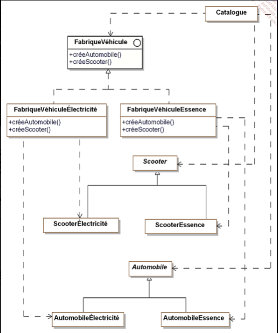

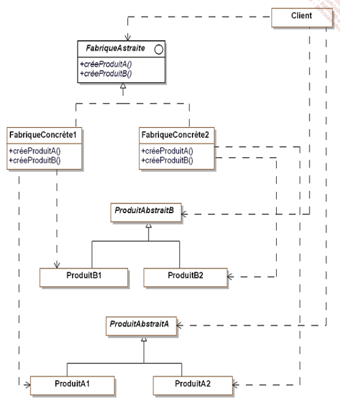

Un scooter peut être électrique ou essence, et sa création est disponible depuis le catalogue.

Nous avons l’interface `FabriquerVehicule`, deux variantes `Electrique` et `Essence`, servent l’interface en implémentant l’interface `FabriquerVehicule`. 
En choisissant de fabriquer un scooter, on choisit quelle variante utiliser permettant d’implémenter le véhicule avec les propriétés d’un scooter, qui va elle appeler la fabrique concrète qui est en charge de crée un véhicule électrique 

## Session du 04/07/2022 : 9h45 – 11h15 | Patern Builder

### Objectif : Besoin de construire des objets complexes sans connaître son implémentation.
Réaliser la création d'objets ayant plusieurs implémentations, dit complexes, sans avoir à s'occuper des problèmes d'implémentations avec une utilisation pour séparer la logique interne et client.

### Exemple basique / UML
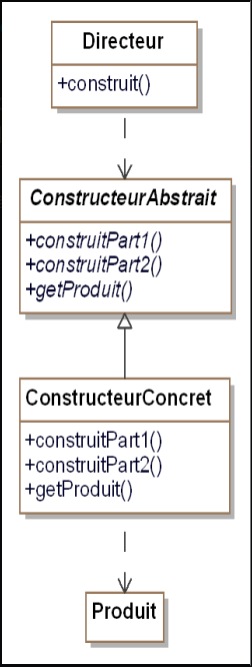

### Exemple avec le contexte de liasse véhicule / UML
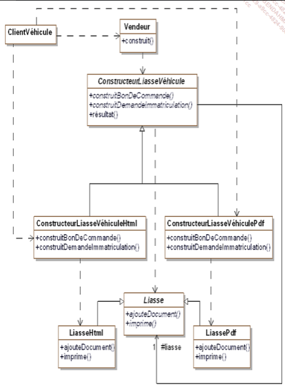

## Session du 04/07/2022 : 11h30 – 13h | Structure liasse véhicule 

`Commande` est une classe abstraite qui est basée sur la `Factory Methode`

`Client` est elle aussi une classe abstraite

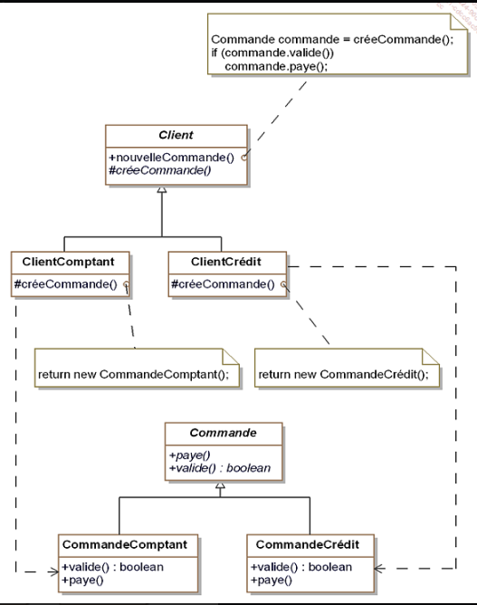

Présentation de la `Factory Méthode : Generic`

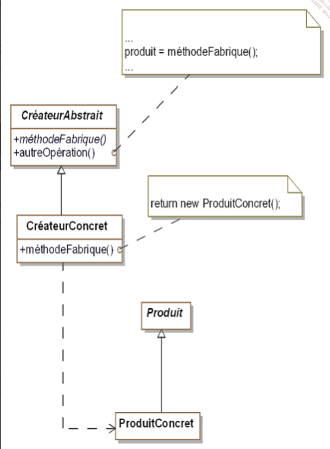

## Session du 05/07/2022 : 14h00 - 15h30 | Singleton

Pattern de création
Le singleton est un patron de conception de création qui garantit et exige que l’instance d’une classe n’existe que en un seul exemplaire unique, en donnat un acces à cette instance pour l'intégralité de l'application

Un pattern Abstract va etre susceptible d'utiliser ce type d'instance unique.

### Un exemple du singleton 

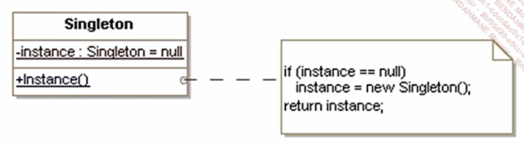

### Dans le cas de notre application 

On va utiliser la classe `liasse`.

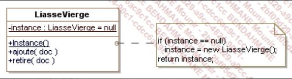

### Exercice : Création d'une instance globale du vendeur

Exemple de mon singleton

```csharp
public class Vendeur
{
    private static Vendeur _instance = null;
    public decimal primes { get; set; }

    private Vendeur() {
    }

    public static Vendeur Instance()
    {
        if (_instance == null)
            _instance = new Vendeur();
        return _instance;
    }
}
```

```csharp
static void Main(string[] args)
{
    Vendeur vendeur1 = Vendeur.Instance();
    Vendeur vendeur2 = Vendeur.Instance();

    vendeur1.primes = 455;
    if(vendeur2.primes == vendeur1.primes)
        Console.WriteLine("Singleton ok");
    else
        Console.WriteLine("Singleton ko");
}
```

## Session du 05/07/2022 : 15h45 - 17h15 | Pattern de structure / structuration / Pattern adapter

### Pattern de structure / structuration

Les patterns de structuration permettent de faciliter l'idépendance de l'interface d'un objet et de son implémentation.

En fournissant les interfaces ce pattern permet d'encapsuler la compositions des objets.

Ceci joue sur l'augmentation du niveau d'abstraction d'un système donné à la manière des patterns de création encapsulant la création d'objets.

### Explication : La différence entre l'héritage et la composition

La différence se situe sur le role de chaqu'une par rapport aux relation : 

- Une composition comporte une relation entre les objets
- L'héritage est lui meme une relation entre les classes 

On note aussi une différence dans l'utilisation, la composition pour l'injection de dépendance et l'héritage dans le polymorphisme.

Deux exemples afin d'ilustrer mes propos : 

### Composition : 

```csharp
class Identifier
{
    
}

class Identifier2
{
    Identifier id1 = new Identifier();
    id1.Member();
}
```

### Héritage : 

```csharp
public class A
{
    protected int _value = 69;
}

public class C : A
{
   this._value = 69;
}
```

### Pattern adapter

Pattern structurel

Le but de ce pattern est de convertir l'interface d'une classe donnéee en une interface attendue par des clients afin qu'ils puissent travailler ensemble 
En résumé, il permet de donner à une classe existante une nouvelle interface pour répondre aux besoins d'un client.

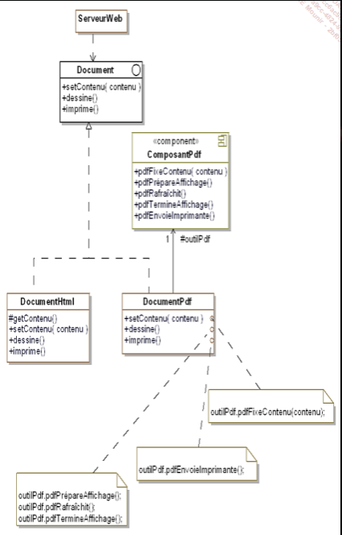

## Session du 05/07/2022 : 17h30 - 19h00 | Autonomie réserver au projet

Début de projet pour le Singleton

## Session du 06/07/2022 : 14h00 - 15h30 | Pattern bridge / Composite / Decorator

Pattern structurel
Le but de ce pattern est de séparer le comportement de l'implémentation de l'interface et de l'implémentation de l'objet.
On s'intéresse au demande d'immatriculation des véhicules.
Le formulaire de demande d'immatriculation possède deux implémentations différentes.

Classe abstraite mère: FormulaireImmat

Classe fille :

FormulaireImmatHTML
FormulaireImmatAPP

Au départ le système a été conçu pour la France uniquement.
Ensuite on a du créé en sous-classe FormulaireImmatCH elle aussi abstraite pour avoir également deux sous-classes concrètes (qui sont FormulaireImmatHTML et FormulaireImmatAPP dédiées à la Suisse)

ABSTRACTION : `abstract class` IMPLEMENTATION : `interface`

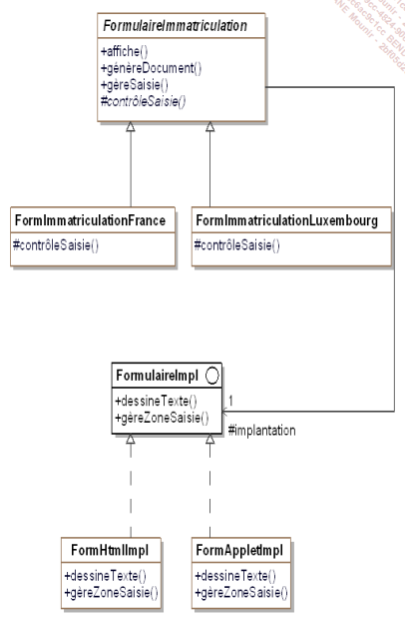

### Exemple concret

```csharp
public class Utilisateur
{
  static void Main(string[] args)
  {
    FormImmatriculationLuxembourg formulaire1 = new
      FormImmatriculationLuxembourg(new FormHtmlImpl());
    formulaire1.affiche();
    if (formulaire1.gereSaisie())
      formulaire1.genereDocument();
    Console.WriteLine();
    FormImmatriculationFrance formulaire2 = new
      FormImmatriculationFrance(new FormAppletImpl());
    formulaire2.affiche();
    if (formulaire2.gereSaisie())
      formulaire2.genereDocument();
  }
}
```

```csharp
public class FormImmatriculationLuxembourg :
  FormulaireImmatriculation
{
  public FormImmatriculationLuxembourg(FormulaireImpl
    implantation) : base(implantation){}

  protected override bool controleSaisie(string plaque)
  {
    return plaque.Length == 5;
  }
}
```

### Intérogation sur le contexte du design pattern Composite 

Ce pattern offre un cadre de conception d'objet dont on ne connait pas la profondeur.
On peut utiliser un arbre en tant qu'analogie

Deux exemples : 

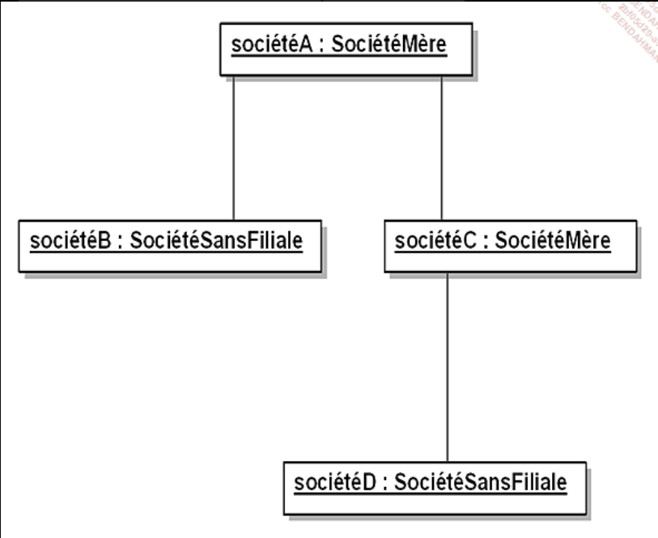

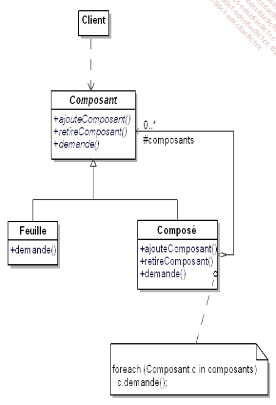

### Pattern Decorator

Ce pattern permet d'ajouter dynamiquement des foncionnalitées supplémentaires à un objet sans modifier l'interface de l'objet ("les clients de l'objet ne sont pas au courant de la modification")

Il s'agit d'une alternative à la création d'une sous-classe qui permettrait d'enrichir l'objet.


## Session du 06/07/2022 : 15h45 - 17h15 | Pattern de comportement / Chain of responsability / Decorator

Les pattern de comportement permettent de distribuer des traitements/ des algorithmes entre les objets.
Ils organisent les interactions en renseignant le "flux de controle" et de traitement au sein d'un système d'objets.
La distribution se fait soit par héritage soit par "délégation".

### Pattern Chain of Responsability

Le but est de construire une chaine d'objets de manière à ce que si un objet de la chaine ne peut répondre à une enquête, il puisse la passer à un "successeur" et ainsi de suite jusqu'à ce que l'un des objets puissent y répondre.

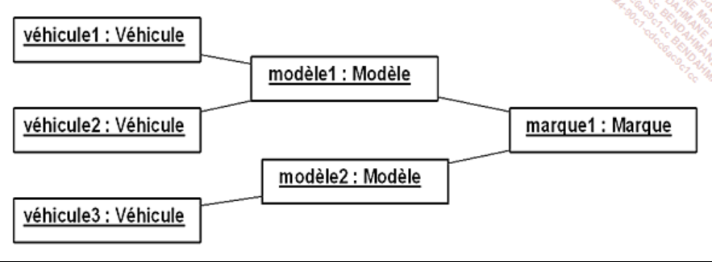

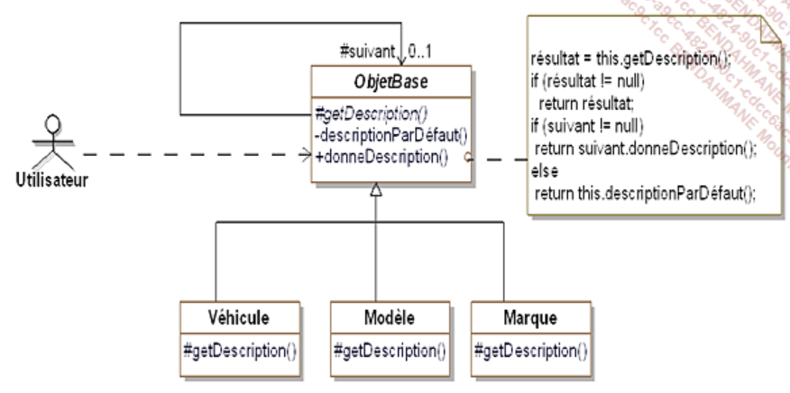

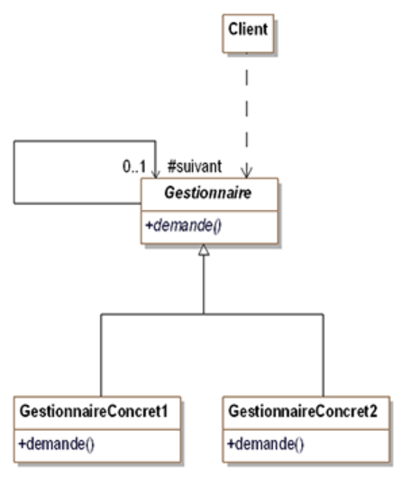

### Pattern Command

C'est un patron de conception comportemental qui prend une action à effectuer et la transforme en objet avec l'intégralité des détails de cette action. Ce qui permet de paramétrer des méthodes avec différentes actions, les planifier ect..

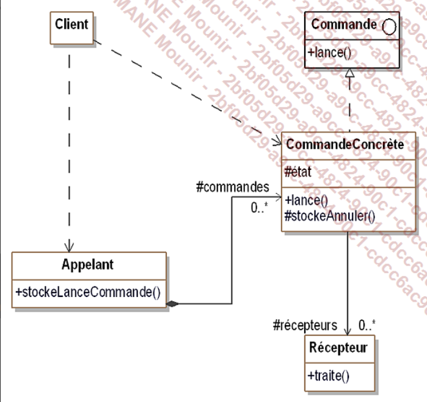

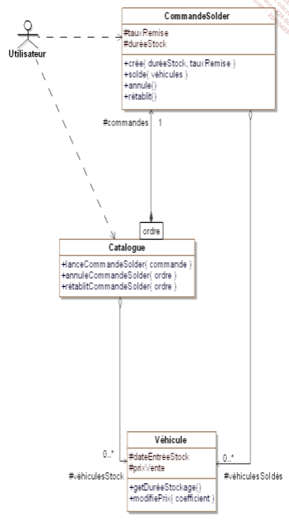

### Pattern Iterator

C'est est un patron de conception comportemental qui permet de parcourir les éléments d’une collection sans révéler sa représentation.

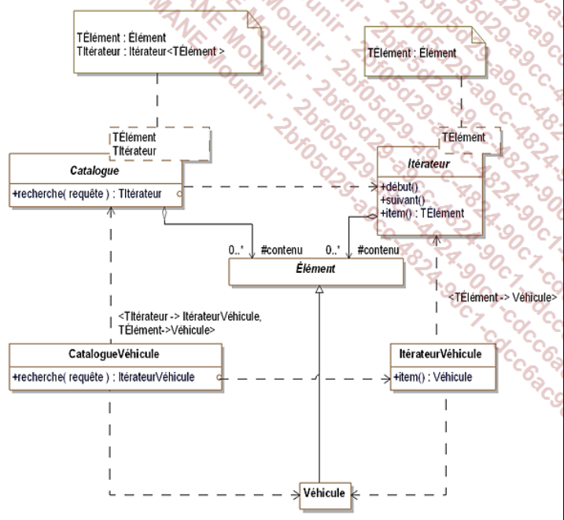

### Médiator

Médiateur est un patron de conception comportemental qui diminue les dépendances problématique entre les objets. Il restreint les communications et permet de gérer la "circulation".


